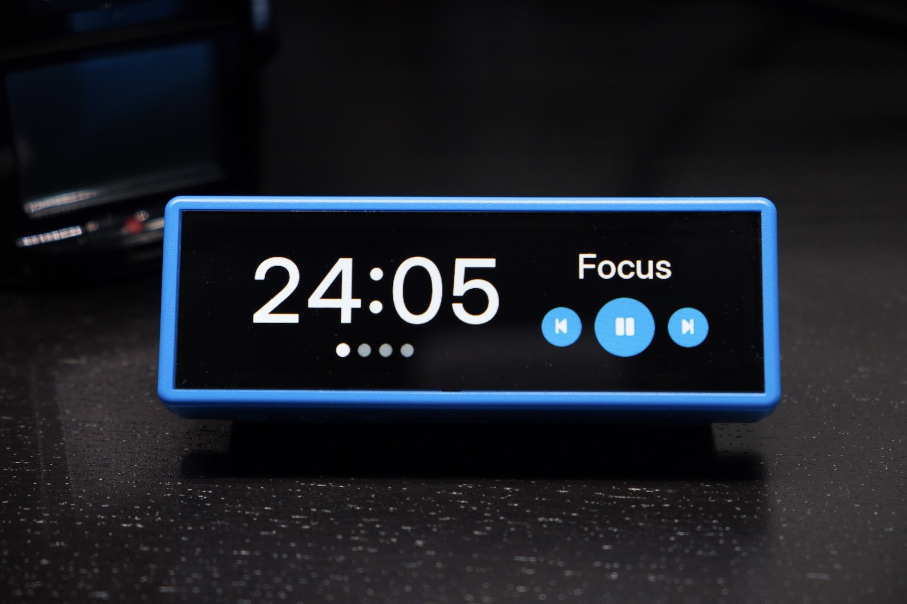
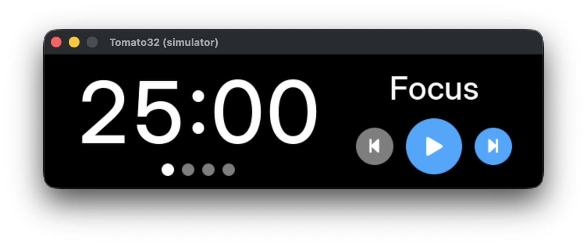
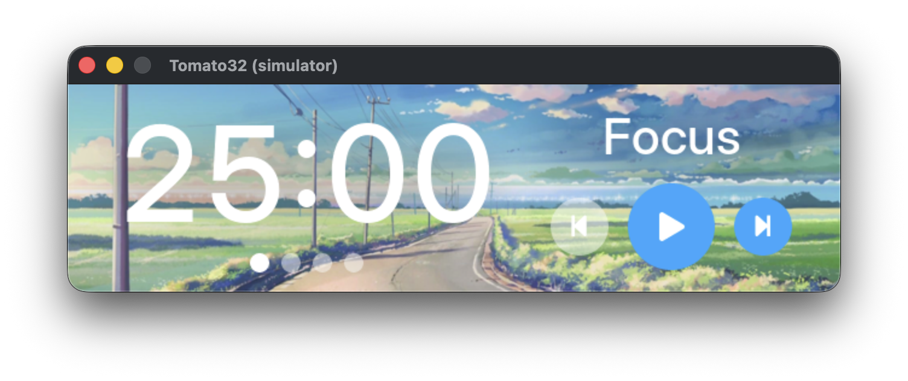
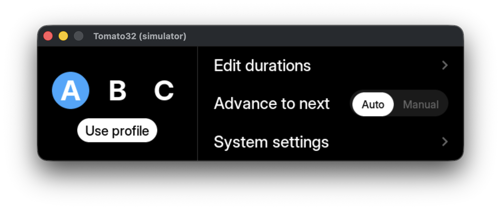
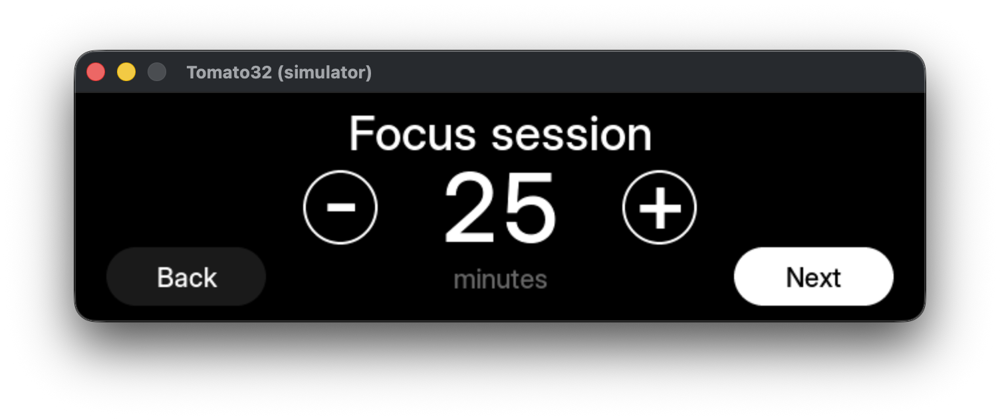
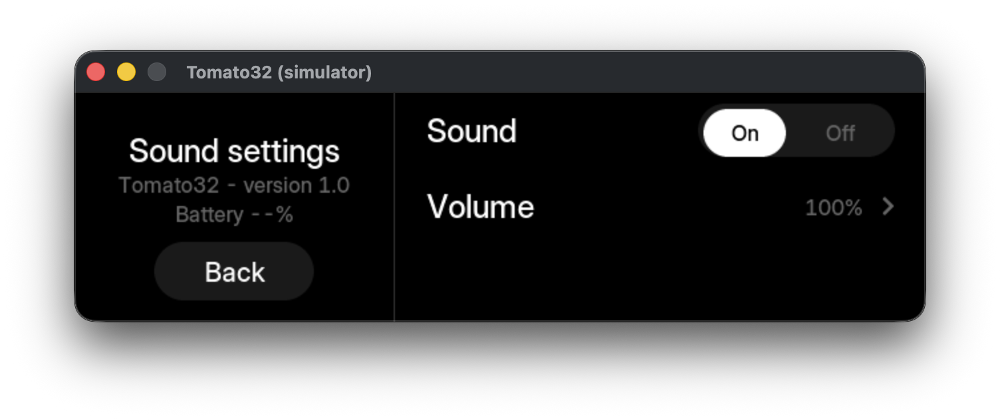

# Tomato32



Tomato32 is a [Pomodoro](https://en.wikipedia.org/wiki/Pomodoro_Technique) timer for the [Waveshare ESP32-S3-Touch-LCD-3.49](https://www.waveshare.com/esp32-s3-touch-lcd-3.49.htm) development board.

## Video

https://github.com/user-attachments/assets/c5f4a6f5-b433-481a-8e97-07911eff9add

## Features

- Touchscreen interface
- Three preset timer profiles, each with customizable durations
  - You can adjust the durations for focus time, short break, long break, and the number of focus sessions before a long break.
- Various settings to make it fit your workflow.
- Custom background support (see [Custom Backgrounds](#custom-backgrounds))

## Requirements

### Simulator (macOS)

- CMake
- SDL2

```sh
brew install cmake sdl2
```

### ESP32 Hardware Target

- [Waveshare ESP32-S3-Touch-LCD-3.49](https://www.waveshare.com/esp32-s3-touch-lcd-3.49.htm) development board
- Python 3
- Docker (used by the ESP32 build/flash script)

## Quick Start (Simulator)

> [!NOTE]
> The simulator has only been tested on macOS. If you get it working on Linux or Windows, a PR adding setup instructions would be welcome.

```sh
cmake -B build
cmake --build build
./build/platform/simulator/pomodoro_sim
```

## ESP32 Build and Flash

Create the environment file first:

```sh
cp platform/esp32/.env.example platform/esp32/.env
```

For NTP/RTC time sync, set these values in `.env`:

- `WIFI_SSID`
- `WIFI_PASS`
- `WIFI_TZ` (default: `UTC0`)

> [!NOTE]
> **Why do I need Wi-Fi for a Pomodoro timer?**
>
> Wi-Fi is only used to sync the date and time via NTP and update the RTC. This is only needed for the daily "Focused today" statistic. Providing Wi-Fi credentials is completely optional. Without them, the timer will still work, but the "Focused today" stat may not reset at the correct local midnight.

### Build and flash

```sh
cd platform/esp32
python -m venv .venv
source .venv/bin/activate
pip install -r requirements.txt
./build.sh
./build.sh flash /dev/cu.usbmodem101
./build.sh monitor /dev/cu.usbmodem101
```

> [!NOTE]
> Replace `/dev/cu.usbmodem101` with the actual serial port of your ESP32 board. Run `ls /dev/cu.*` before and after plugging in the board to identify the correct port.

## Custom Backgrounds

To use a custom background image on the timer, go to **System Settings → UI → Custom Backdrop** and set it to **On**.

Place your image files (640×172 PNG) in the `app/` directory, then rebuild and flash.

### Custom background file naming

Tomato32 uses the most specific matching file available. Name your files accordingly:

| Specificity    | File name example              | When it's used           |
| -------------- | ------------------------------ | ------------------------ |
| Preset + theme | `custom_background_b_dark.png` | Preset B, dark mode only |
| Preset only    | `custom_background_b.png`      | Preset B, both themes    |
| Theme only     | `custom_background_dark.png`   | Any preset, dark mode    |
| _(fallback)_   |                                | Default solid color      |

Valid preset suffixes are `_a`, `_b`, and `_c`. Valid theme suffixes are `_dark` and `_light`.

> [!IMPORTANT]
> Background images are embedded into the firmware at build time. Whenever you add or remove PNG files in `app/`, run a clean build so CMake picks up the changes:
>
> ```sh
> cd platform/esp32
> ./build.sh clean
> ./build.sh flash /dev/cu.usbmodem101
> ```

## Third-Party Licenses

This project vendors LVGL under `lvgl/`.

- Project-level notices: `THIRD_PARTY_NOTICES.md`
- LVGL license: `lvgl/LICENCE.txt`
- LVGL third-party attributions: `lvgl/COPYRIGHTS.md`

### Typeface

The typeface used in the UI is [Inter](https://rsms.me/inter/), licensed under the SIL Open Font License 1.1.

### Sound effect

The sound effect used for timer start/end is sourced from [freesound.org](https://freesound.org/people/JetRye/sounds/140128) and licensed under Creative Commons 0.

### Custom background images

#### Dark mode

- Photo by [Federico Respini](https://unsplash.com/@federicorespini) on [Unsplash](https://unsplash.com/photos/brown-field-near-tree-during-daytime-sYffw0LNr7s).

#### Light mode

- Photo by [Alex Machado](https://unsplash.com/@alexmachado) on [Unsplash](https://unsplash.com/photos/cloudy-sky-80sv993lUKI).

## Screenshots










